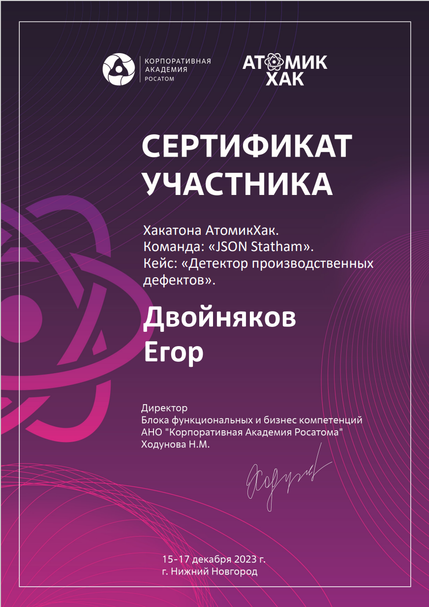
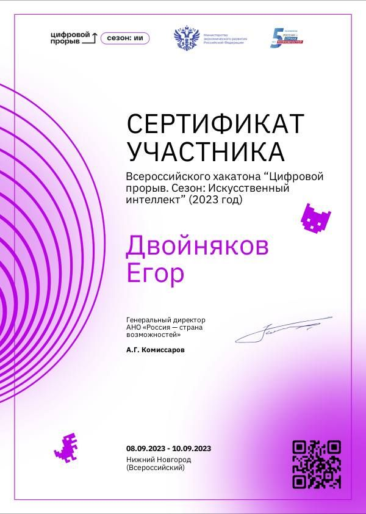
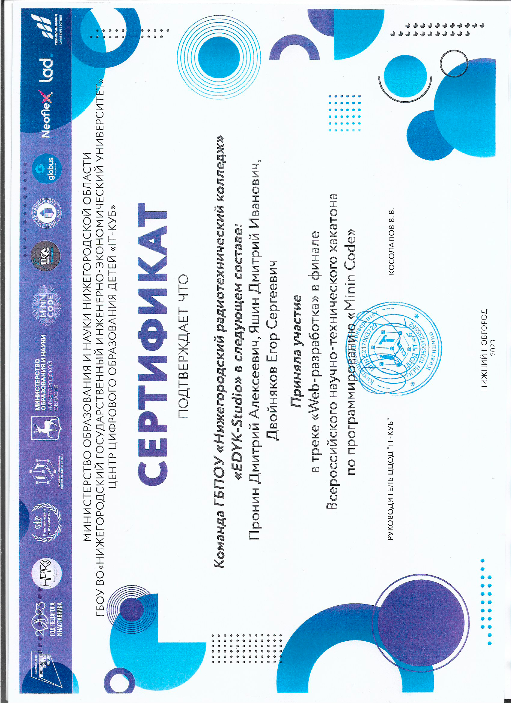
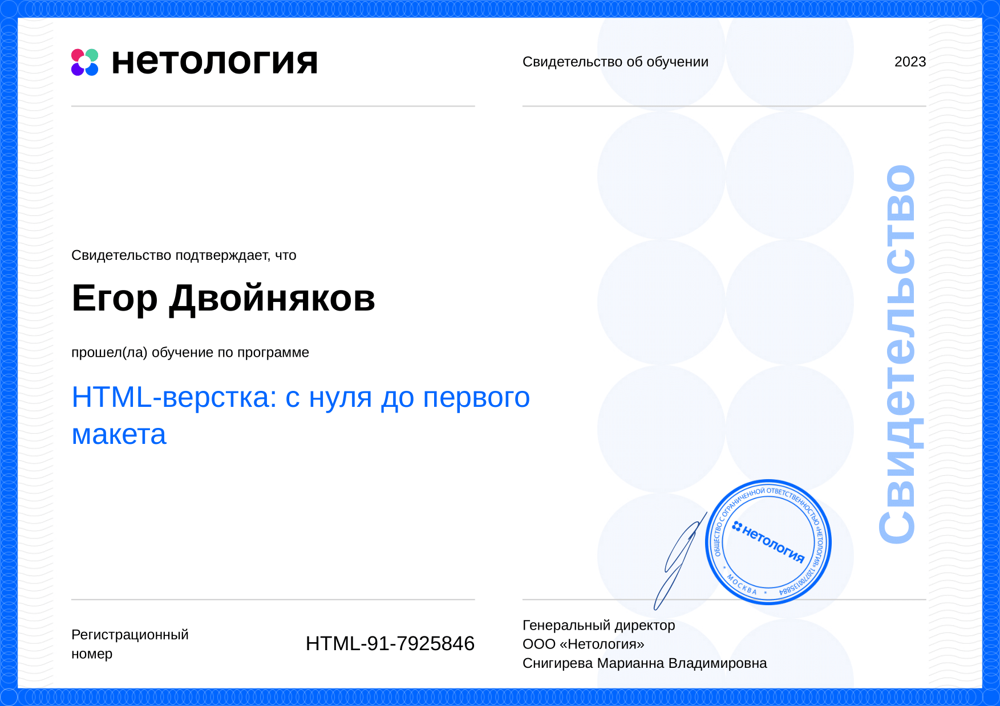
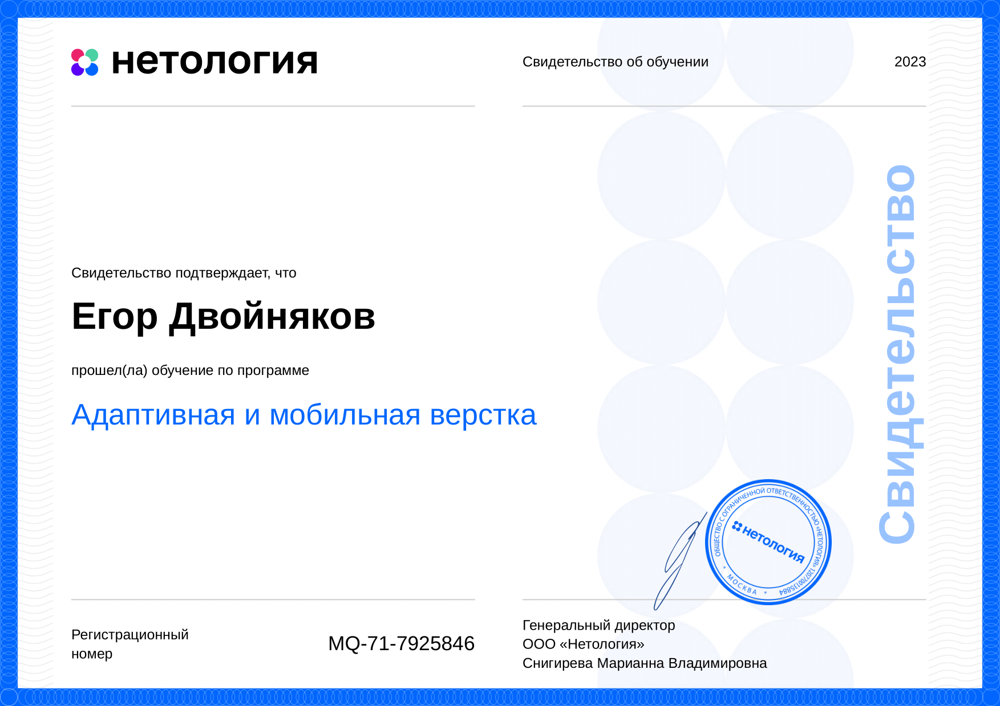
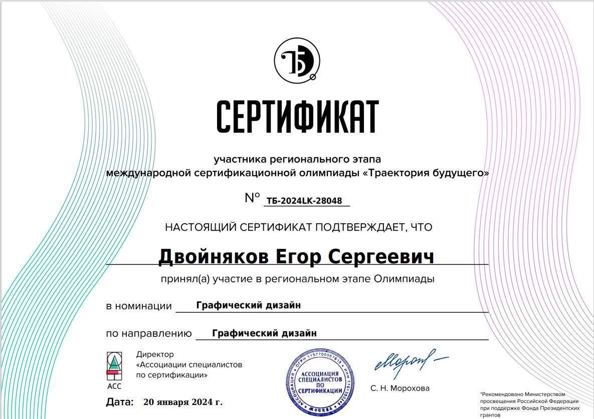

### In brief about me:
I'm beginner front-end developer and college student, studying to become a programmer.

 I often participate in various IT events.

## Languages and tools:

  

    
   

 

## My achievements:

 

## Statistic:

